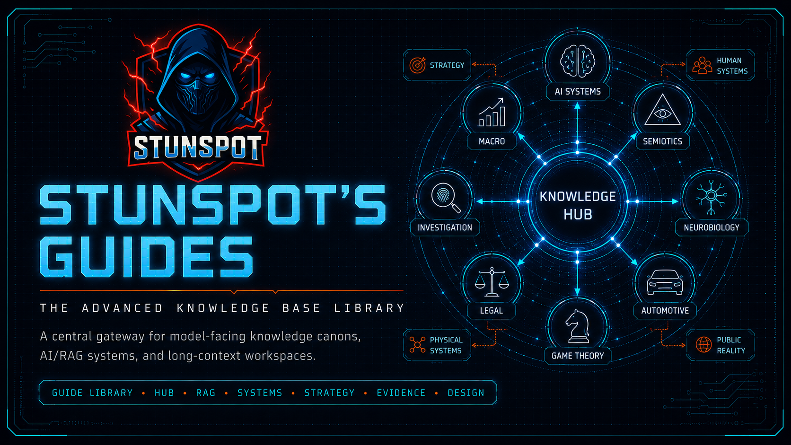

  

# Stunspot’s Guides

**The Advanced Knowledge Base Library**  
*A central public gateway for the Stunspot’s Guide to… model-facing knowledge canons.*

These guides are Markdown-native knowledge repositories built for AI/RAG ingestion, long-context workspaces, project knowledge bases, retrieval corpora, agent memory layers, and serious human reference.

Human readers can browse them like field manuals. Their deeper purpose is to make models better at domain reasoning by giving them structured doctrine, stable vocabulary, conceptual maps, failure diagnostics, and operational heuristics.

## Library Map

| Domain | Start Here |
|---|---|
| AI systems, prompt engineering, RAG, agents, evals | [AI Systems](https://github.com/Stunspot/stunspots-guide-to-ai-systems) |
| Meaning, signs, reference, symbolic interpretation | [Semantics, Semiotics, and Symbols](https://github.com/Stunspot/stunspots-guide-to-semantics-semiotics-and-symbols) |
| Money, liquidity, credit, macro regimes | [Macroeconomics](https://github.com/Stunspot/stunspots-guide-to-macroeconomics) |
| Human behavior, regulation, embodiment, adaptive cognition | [Human Behavioral Neurobiology](https://github.com/Stunspot/stunspots-guide-to-human-behavioral-neurobiology) |
| Vehicles, diagnostics, repair logic, machine systems | [Automotive Systems](https://github.com/Stunspot/stunspots-guide-to-automotive-systems) |
| Venture design, markets, operations, business viability | [Business Venture Formulation](https://github.com/Stunspot/stunspots-guide-to-business-venture-formulation) |
| Incentives, equilibrium, conflict, cooperation, governance | [Game Theory](https://github.com/Stunspot/stunspots-guide-to-game-theory) |
| Food physics, formulation, culinary systems | [Gastronomic Engineering](https://github.com/Stunspot/stunspots-guide-to-gastronomic-engineering) |
| Legal systems, authority, proof, procedure, execution | [Legal Mastery](https://github.com/Stunspot/stunspots-guide-to-legal-mastery) |
| Prospecting, buyer systems, demand signals, GTM reasoning | [Sales Prospecting Strategy](https://github.com/Stunspot/stunspots-guide-to-sales-prospecting-strategy) |
| Evidence, sources, public reality, narrative operations | [Investigative News Intelligence](https://github.com/Stunspot/stunspots-guide-to-investigative-news-intelligence) |

## What Makes These Different

These are not ordinary blog archives or casual reading notes. They are model-facing canons: structured knowledge substrates intended to be loaded into AI environments so models can reason with more precision.

Each guide usually includes:

- individual source reports under `knowledge-packs/by-report/`
- grouped upload packs under `knowledge-packs/compiled-packs/`
- whole-corpus omnibus bundles under `knowledge-packs/omnibus/`
- public guidance and navigation under `docs/`
- citation, license, status, changelog, and manifest files at the repository root

## Pages

This GitHub Pages site is the GitHub-native gateway. A normal-public landing page lives at:

**https://stunspot.com/#guides**
